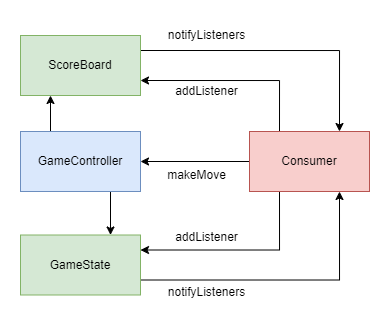

# Tic Tac Toe Engine

This project features a simple game engine for building Tic Tac Toe games. The project is built to be highly customizable, allowing for multiple different types of implementations.

## Features

The below is a list of features that have been implemented.

Pure dart engine:

- [x] Built-in Scoreboard
- [x] Configurable Rules (Number of Rows and Columns, Number of consecutive moves to win)
- [x] Current Game Info (How many moves, which players turn)
- [x] Game History

Flutter widgets:

- [x] TicTacToeBuilder - Simple builder widget that rebuilds on game state changes
- [x] TicTacToeBoard - Dynamic TicTacToe board built depending on game settings, and can be styled

_The below is a list of features that **could** be interesting to explore, and expand the project with:_

- [ ] Variable amount of Players (Turn your game into a battle royale!) - Fits well with larger grids
- [ ] Persistence Helpers

## Project

This project is the parent of the TicTacToe Engine itself, and showcases how a TicTacToe game can be built using the engine, and extending it.

The project, and the Flutter widgets of the TicTacToe package, is built using this [Figma Design](https://www.figma.com/file/gwv7fHKOBBQAouYbYHlIk3/TicTacToe%3A-Example-Application?type=design&node-id=0%3A1&t=gnn7bTb7tCMLfwwX-1). Due to UI/UX constraints (as in the fact that I am not one), the complete design is in one page. The project is based on 3 resolutions, that will make it playable on Mobile, Tablet, Web, and Desktop.

## State mechanism

The engine uses [ChangeNotifier](https://api.flutter.dev/flutter/foundation/ChangeNotifier-class.html)'s to offer updates on current game state and the scoreboard. This allows the consumer to only listen to what is relevant, eg. the scoreboard can be implemented separately based on just the updates from the game state.

The game is controlled via one event only, which is the `makeMove` event. The controller feeds the event downwards to the game state manager, and the result of the move from the manager is returned back to the controller, which then accordingly updates the scoreboard.

A simple diagram to illustrate the architecture is attached below, please note that it is not displayed for accuracy, but to illustrate how a consumer can use the game state and scoreboard separately.

_If requested, a more accurate version of the state architecture can be drawn._
